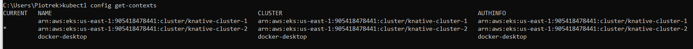

# Hybrid serverless
## Piotr Ryczek, Kinga Ramęda, Aleksander Pytel

### Skrócony opis projektu
Przygotować proste PoC z migracji obliczeń pomiędzy klastrami knative. 2 proste klastry z kubernetes z osobnym knative i następnie przerzucamy/migrujemy obliczenia/aplikacje pomiędzy nimi. Sprawdzić, jakie wykonania API są niezbędne.


### Konfiguracja środowiska
Wszystkie instrukcje dotyczące instalacji oraz konfiguracji środowiska zostały wykonane na systemie operacyjnym Windows 10 Pro.

1. Potrzebne narzędzia
- AWS CLI https://docs.aws.amazon.com/cli/latest/userguide/getting-started-install.html 
- KUBE CTL
https://kubernetes.io/docs/tasks/tools/ 
- KNATIVE CLI 
https://knative.dev/docs/client/install-kn/
- KNATIVE MIGRATION PLUGIN
https://github.com/knative-extensions/kn-plugin-migration

2. Konfiguracja AWS CLI\
Po zainstalowaniu AWS CLI należy skonfigurować dostęp do konta AWS. W tym celu należy wywołać polecenie `aws configure` i podać odpowiednie dane dostępowe.

3. Utworzenie dwóch klastrów EKS\
Należy utworzyć dwa klastry EKS w AWS. Wchodzimy do konsoli AWS, wybieramy usługę EKS, a następnie tworzymy nowy klaster i konfigurujemy go. W przypadku naszego projektu utworzyliśmy dwa klastry: `knative-cluster-1` oraz `knative-cluster-1`.

4. Dodanie klastrów do konfiguracji kubectl\
Aby dodać klastry do konfiguracji kubectl wywołujemy polecenia
```
aws eks describe-cluster --region us-east-1 --name <your cluster> --query cluster.status
aws eks --region us-east-1 update-kubeconfig --name <your cluster>
```
\
\
5. Instalacja Knative\
Instalujemy knative serving na obu klastrach. W tym celu przechodzimy do odpowiedniego kontekstu klastra
```
kubectl config use-context <your cluster>
```
Następnie instalujemy knative serving za pomocą poleceń
```
kubectl apply -f https://github.com/knative/serving/releases/download/knative-v1.14.1/serving-crds.yaml

kubectl apply -f https://github.com/knative/serving/releases/download/knative-v1.14.1/serving-core.yaml

kubectl apply -f https://github.com/knative/net-kourier/releases/download/knative-v1.14.0/kourier.yaml

kubectl patch configmap/config-network \
  --namespace knative-serving \
  --type merge \
  --patch '{"data":{"ingress-class":"kourier.ingress.networking.knative.dev"}}'
```

6. Sprawdzenie czy knative działa\
Aby sprawdzić czy knative działa poprawnie, należy wywołać polecenie
```
kubectl get pods --namespace knative-serving
```
Jeśli wszystkie podsy są w stanie `Running` lub `Completed` to znaczy, że knative zostało zainstalowane poprawnie.
\
\
7. Konfiguracja DNS\
> Knative udostępnia zadanie Kubernetes o nazwie default-domain, które konfiguruje Knative Serving do używania sslip.io jako domyślnego sufiksu DNS.

Aby skonfigurować "magicznego" DNS dla klastra, należy wywołać polecenie
```
kubectl apply -f https://github.com/knative/serving/releases/download/knative-v1.14.1/serving-default-domain.yaml
```

8. Powtarzamy kroki 5-7 dla drugiego klastra


### Migracja aplikacji

1. Tworzymy yaml z konfiguacją klastrów
```
kubectl config view --minify --flatten --context=<first_cluster_context> > $HOME/.kube/source.yml

kubectl config view --minify --flatten --context=<second_cluster_context> > $HOME/.kube/dest.yml
```

2. Dodajemy serwis do klastra 1 korzystając z pliku `echo.yaml`
```
kubectl apply -f echo.yaml
```

3. Sprawdzamy czy serwis działa\
Wywołujemy polecenie aby dostać adres URL serwisu, następnie sprawdzamy czy serwis działa poprawnie
```
kn service describe converter -o url
```

4. Uruchamiamy skrypt migracji\
Uruchamiamy skrypt migracji, który będzie przenosił serwis z klastra 1 do klastra 2 oraz z klastra 2 do klastra 1 co 3 minuty
```
migrate/cmd
```

5. Obserwujemy działanie na obu klastrach poprzez wywołanie poleceń
```
kubectl --context <first_cluster_context> get all
kubectl --context <second_cluster_context> get all
```


### Wnioski

Migracja aplikacji pomiędzy klastrami knative jest możliwa, jednak wymaga zastosowania odpowiednich narzędzi. W naszym przypadku skorzystaliśmy z narzędzia `kn-plugin-migration`, które pozwoliło nam na automatyzację procesu migracji. Dzięki temu udało nam się przenieść aplikację pomiędzy klastrami bez konieczności ingerencji w kod źródłowy aplikacji.

Plugin wykorzystuje wywołania API takie jak

1. Sprawdza, czy namespace istnieje w docelowym klastrze.
```
kubectl get namespace <namespace> --kubeconfig <destination-kubeconfig>
```

2. Tworzy namespace w docelowym klastrze, jeśli nie istnieje.
```
kubectl create namespace <namespace> --kubeconfig <destination-kubeconfig>
```

3. Pobiera listę wszystkich usług Knative w określonym namespace w źródłowym klastrze.
```
kubectl get ksvc -n <namespace> -o yaml --kubeconfig <source-kubeconfig>
```

4. Pobiera definicję usługi Knative w formacie YAML z określonego namespace w źródłowym klastrze.
```
kubectl get ksvc <service-name> -n <namespace> -o yaml --kubeconfig <source-kubeconfig>
```

5. Tworzy lub aktualizuje usługę Knative w docelowym klastrze.
```
kubectl apply -f <service-definition-file> --kubeconfig <destination-kubeconfig>
```

6. Usuwa istniejącą usługę Knative w docelowym klastrze przed ponownym utworzeniem jej, jeśli ustawiona jest opcja --force.
```
kubectl delete ksvc <service-name> -n <namespace> --kubeconfig <destination-kubeconfig>
```

7. Pobiera listę wszystkich rewizji danej usługi Knative w źródłowym klastrze.
```
kubectl get revisions -n <namespace> -l serving.knative.dev/service=<service-name> -o yaml --kubeconfig <source-kubeconfig>
```

8. Tworzy rewizję usługi Knative w docelowym klastrze.
```
kubectl apply -f <revision-definition-file> --kubeconfig <destination-kubeconfig>
```

9. Aktualizuje rewizję usługi Knative w docelowym klastrze, aby pasowała do wersji z źródłowego klastra.
```
kubectl get revision <revision-name> -n <namespace> --kubeconfig <destination-kubeconfig> -o yaml > revision.yaml

kubectl apply -f revision.yaml --kubeconfig <destination-kubeconfig>
```

10. Usuwa wszystkie usługi Knative w źródłowym klastrze po migracji, jeśli ustawiona jest opcja --delete.
```
kubectl delete ksvc <service-name> -n <namespace> --kubeconfig <source-kubeconfig>
```


Wykorzystaliśmy również flagi --force i --delete, aby upewnić się, że migracja przebiega poprawnie, forsujemy nadpisanie plików konfiguracyjnych oraz usuwamy serwisy z klastra źródłowego.